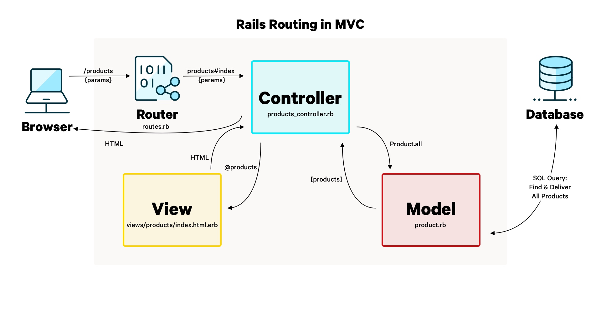

# README

Ruby on Rails Getting Started docs: https://guides.rubyonrails.org/getting_started.html

Checkpoint: https://guides.rubyonrails.org/getting_started.html#controllers-actions

This README would normally document whatever steps are necessary to get the
application up and running.

Things you may want to cover:

* Ruby version

* System dependencies

* Configuration

* Database creation

* Database initialization

* How to run the test suite

* Services (job queues, cache servers, search engines, etc.)

* Deployment instructions

* ...

## Getting Started
* Ruby 3.3.6
* Rails 8.0.1

Reference: https://guides.rubyonrails.org/install_ruby_on_rails.html

## Database Modeling
* Generate Active Record model example: `bin/rails generate model Product name:string`

Reference: https://guides.rubyonrails.org/getting_started.html#creating-a-database-model

### Running Migrations
* Run `bin/rails db:migrate`

## Rails Console
* Run `bin/rails console`

Reference: https://guides.rubyonrails.org/getting_started.html#rails-console

### Reload Changes
* Run this command if you have modified your codes but still keeping the console open and want to see the reflected changes: `reload!`

## Rails Routing


* To define the routes, modify the `config/routes.rb`, example:
  ```ruby
  Rails.application.routes.draw do
    get "/products", to: "products#index"
  end
  ```
* To create all CRUD routes for specific route like `/products`, we can just register it like this instead:
  ```ruby
  resources :products
  ```

* Generate the controller command: `bin/rails generate controller Products index --skip-routes`

Reference: https://guides.rubyonrails.org/getting_started.html#routes